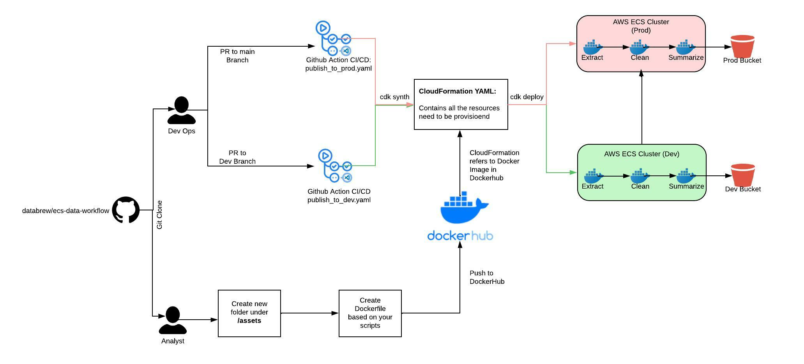

# DataBrew ECS Data Workflow

Author: Aryton Tediarjo (atediarjo@gmail.com)

Reviewer: Joe Brew

## About
This repository is used for creating ECS Data Workflows for DataBrew Projects. 
It consists of two systems requirements:
- [Installing AWS CDK](https://docs.aws.amazon.com/cdk/v2/guide/hello_world.html)
- [Installing Docker](https://docs.docker.com/engine/install/)

This Github repository uses AWS CDK as IaC tooling to automatically provision AWS resources using code. The CDK will point towards a Docker Image in Dockerhub to create scheduled tasks for day to day use-cases. 

## Workflow


To start, clone this repository
```bash
git clone this repo
```

Based on two types of users:

**Data Scientists / Analysts**: 

1. Create a new git branch name: **dev-<ANALYSIS_NAME>**
2. Create a new folder of the analysis or process inside the  **./assets** folder
3. Create and test your scripts under the created folder
4. Create & Test Dockerfile to reproduce the script in a clean container
4. Push Docker to DataBrew Dockerhub
5. Create PR to **uat** branch and assign to @arytontediarjo

**DevOPS** (TODO by @aryton)

1. Review PR 
2. Add in resources from new Dockerfile as task definition


