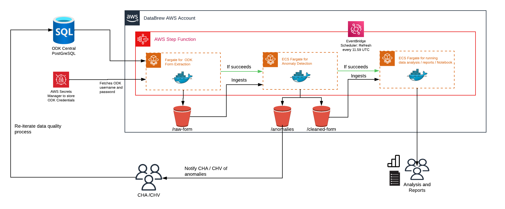

# Stacks: ODK Batch ECS Workflow

This is documentation will cover the end to end infrastructure for DataBrew data ingestion model using ECS that is orchestrated by StepFunctions

1. Survey is ingested from ODK Central PostGreSQL using [ruODK](https://github.com/ropensci/ruODK)
2. Data pipeline will be orchestrated using [AWS Step Functions](https://aws.amazon.com/step-functions/), where each part of the data pipeline will be dependent on the success of the previous process (e.g if form extraction fails then it will not run the next process of anomaly identifcation)
3. Each step function will be running a [ECS Fargate](https://docs.aws.amazon.com/AmazonECS/latest/developerguide/AWS_Fargate.html) Task, where we are using [Dockerhub Images](https://www.docker.com/products/docker-hub/) for submitting our R jobs. [Check out our Image Index](/docs/dockerhub_index.md)
4. Each of the ECS Fargate Task will output files into [S3](https://aws.amazon.com/s3/) buckets for different use cases
5. Step Function will be scheduled to run every 11.59PM UTC using [EventBridge](https://aws.amazon.com/eventbridge/) rule

## Documentation Video
- [AWS Data Architecture](https://youtu.be/ynzGaaZalEk)
- [AWS Console Demo](https://youtu.be/dn2rRYwwgxU)

