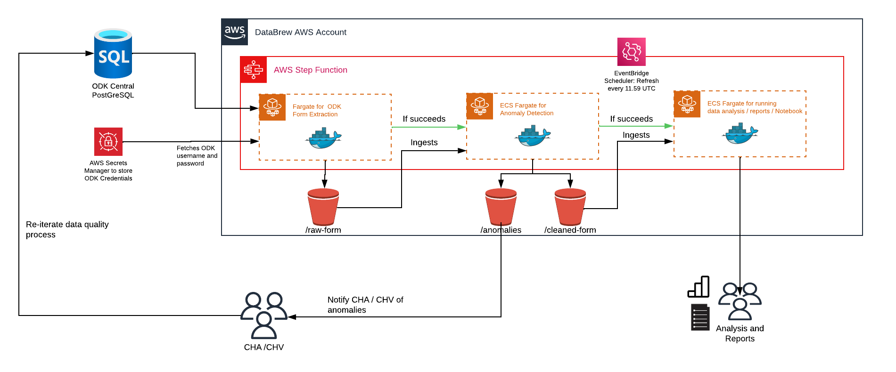

# AWS Workflow

This is documentation will covers overall Data Architecture

1. Data flows in from ODK Central, we are currently using [ruODK](https://github.com/ropensci/ruODK) library to extract our survey forms

2. Data pipeline will be orchestrated using [AWS Step Functions](https://aws.amazon.com/step-functions/), where each part of the data pipeline will be dependent on the success of the previous process e.g if extraction fails then it will not run anomaly identifcation

3. Each step function will be running a [ECS Fargate](https://docs.aws.amazon.com/AmazonECS/latest/developerguide/AWS_Fargate.html) Task, where we are use [Dockerhub Images](https://www.docker.com/products/docker-hub/) for each of the R jobs. [Check out our Image Index](/docs/dockerhub_index.md)

4. Each of the ECS Fargate Task will output files into [S3](https://aws.amazon.com/s3/) buckets of different use cases

5. Step Function will be scheduled to run every 11.59PM UTC using [EventBridge](https://aws.amazon.com/eventbridge/) rule

