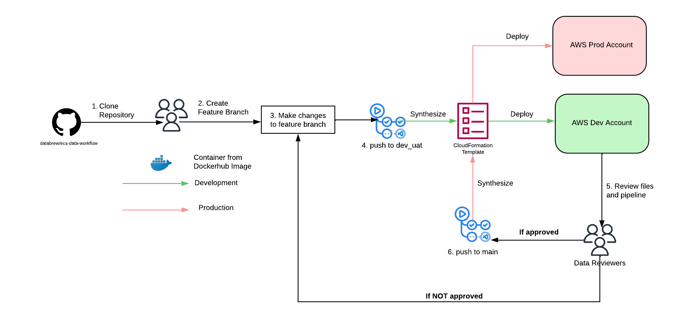

# Continuous Integration/Deployment

This is documentation will cover the CI/CD process of the data infrastructure

2 accounts are being used in this process:
- databrew-dev (Account No: 381386504386)
- databrew-prod (Account No: 354598940118)

1. Clone Github Repository
2. Create a feature branch
3. Make changes to data pipeline by modifying the files under [this folder](../ecs_data_workflow)
4. Once changes are made, create a PR to `dev_uat` branch. Once merged, [Github Actions](../.github/workflows) will automatically synthesize a [CloudFormation template](https://aws.amazon.com/cloudformation/resources/templates/) and deploy your resources based on the yaml created in the process
5. As data is deployed in the databrew-dev account, work with the team to review the results of the data, folder formatting etc.
6. If approved, create a PR to `main` where we will do final QA. Once PR is merged, Github Actions will automatically do all the resource provisioning into the databrew-prod account

